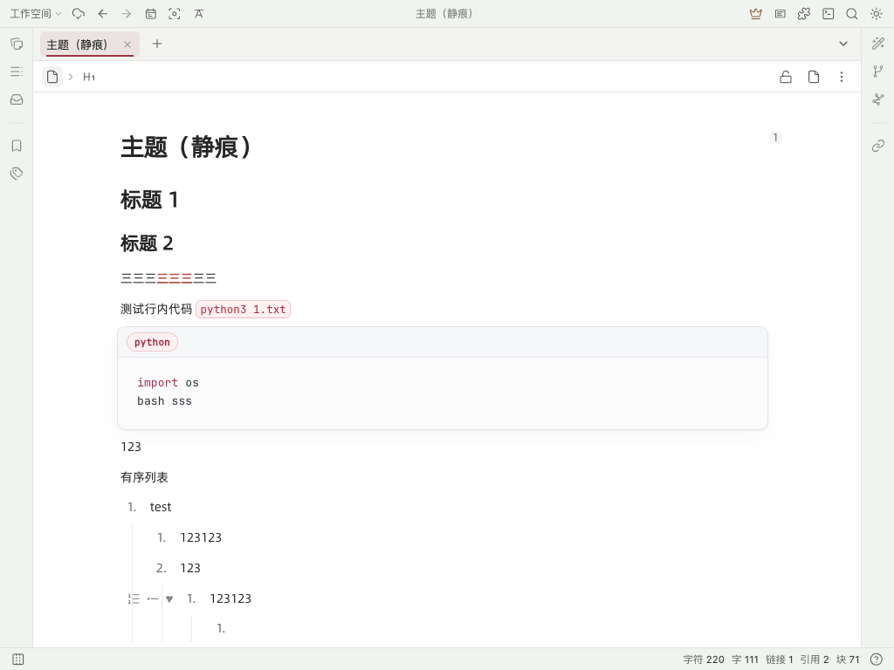

[中文](https://github.com/houm01/siyuan-theme-stillmark/blob/main/README.zh-CN.md)

# Stillmark

Stillmark is a quiet, restrained theme for [SiYuan](https://github.com/siyuan-note/siyuan), built around a clean white editor canvas and clear long-form reading.



## Features

- A white-first light mode with low-saturation neutral chrome
- A carefully matched dark mode
- Compact muted-berry inline code that preserves paragraph rhythm
- Focused code blocks with line-number, toolbar, folding, and Highlight.js support
- Graphite block references with subtle red navigation markers
- Quote blocks with a muted berry rule and upright warm-gray text
- A neutral globe marker for external links, with source-site favicons when the optional Stillmark Workbench plugin is installed
- Duplicate-bookmark path annotations when the optional Stillmark Workbench plugin is installed
- A CSS-only theme package for SiYuan 3.7.0 or later

## Installation

After the theme is accepted into the community marketplace, install it from **Settings → Marketplace → Themes**, then select **Stillmark** under **Settings → Appearance → Theme**.

For manual installation or development, clone the repository and make it available under the SiYuan theme directory:

Clone the repository and make it available under the SiYuan theme directory:

```bash
git clone https://github.com/houm01/siyuan-theme-stillmark.git
ln -s /path/to/siyuan-theme-stillmark \
  /path/to/SiYuan/conf/appearance/themes/siyuan-theme-stillmark
```

Switch themes once or restart SiYuan after editing `theme.css` if the change is not reloaded immediately. Select Stillmark separately for light and dark mode if you want to use it in both modes.

## Files

- `theme.json`: marketplace metadata and supported modes
- `theme.css`: theme variables and component styles
- `icon.png`: 160×160 marketplace icon
- `preview.png`: 1024×768 marketplace preview
- `CHANGELOG.md`: release history

Run `./scripts/build-package.sh` to produce the marketplace `package.zip`. The builder includes only the documented theme assets and rejects JavaScript in the archive.

## License

[MIT](LICENSE)
